# CarPaint-PMD-Dataset

[English](README.md) | [简体中文](README_zh-CN.md)

本数据集面向汽车漆面缺陷检测，包含 2,502 个空间对齐的多表征样本。每个样本由一幅绝对相位图（`AP`）和四幅相应的相移正弦条纹图（`sin0`～`sin3`）组成，这些图像通过相位测量偏折术（Phase Measuring Deflectometry，PMD）成像过程获得。同一样本的五幅图像使用相同的文件名。

## 数据集结构

```text
CarPaint-PMD-Dataset/
|-- images/
|   |-- AP/
|   |-- sin0/
|   |-- sin1/
|   |-- sin2/
|   `-- sin3/
|-- labels/
|-- train.txt
|-- val.txt
|-- dataset.yaml
|-- examples/
`-- tools/
    |-- export_single_view_yolo.py
    `-- verify_dataset.py
```

每个图像表征目录均包含完整的 2,502 幅图像。`labels` 包含一套由五种表征共享的 2,502 个 YOLO 格式标注文件。`train.txt` 和 `val.txt` 保存实验所用的数据划分，其中每一行是一个不含扩展名和表征路径的样本文件名。

## 数据集统计

| 划分 | 样本数 | 标注框数 |
|---|---:|---:|
| 训练集 | 2,002 | 5,033 |
| 验证集 | 500 | 1,404 |
| 合计 | 2,502 | 6,437 |

空标签文件表示不含已标注缺陷的负样本。

## 缺陷类别

YOLO 类别编号从 0 开始：

| ID | 类别 | 训练集实例数 | 验证集实例数 | 合计 |
|---:|---|---:|---:|---:|
| 0 | breakage（破损） | 1,646 | 526 | 2,172 |
| 1 | inclusion（夹杂） | 1,209 | 289 | 1,498 |
| 2 | scratch（划痕） | 1,425 | 405 | 1,830 |
| 3 | crater（缩孔） | 199 | 51 | 250 |
| 4 | run（流挂） | 113 | 17 | 130 |
| 5 | bulge（凸起） | 321 | 79 | 400 |
| 6 | condensate（凝露） | 120 | 37 | 157 |

每一行标注采用标准 YOLO 目标检测格式：

```text
class_id x_center y_center width height
```

四个坐标值均归一化至 `[0, 1]`。

## 多表征数据的使用

读取 `train.txt` 或 `val.txt` 中的样本 ID 后，可按以下路径载入空间对齐的输入图像和标注：

```text
images/AP/{sample_id}.png
images/sin0/{sample_id}.png
images/sin1/{sample_id}.png
images/sin2/{sample_id}.png
images/sin3/{sample_id}.png
labels/{sample_id}.txt
```

`dataset.yaml` 描述了上述多表征目录结构，供自定义多输入数据加载器使用。原生 Ultralytics YOLO 可以使用文本文件进行数据划分，但不能直接将每个样本的五幅对齐图像作为联合输入。

## 导出标准的单表征 YOLO 数据集

如需复现常规的单表征基线，可将任意一种表征导出为标准 Ultralytics YOLO 目录：

```bash
python tools/export_single_view_yolo.py --view AP
python tools/export_single_view_yolo.py --view sin0
```

导出结果包含 `images/{train,val}`、`labels/{train,val}` 和一个本地 `data.yaml`。当源目录和导出目录位于同一文件系统时，可以使用 `--mode hardlink` 避免重复占用图像存储空间。

## 数据验证

下载或修改数据集后，运行以下命令进行验证：

```bash
python tools/verify_dataset.py
```

验证脚本会检查数据划分完整性、不同表征之间的文件名对齐、PNG 图像尺寸、图像与标签的对应关系、YOLO 坐标以及各类别实例数。

## 样例

下面的代表性样本展示了全部七种缺陷，以及它们在绝对相位图和四幅相移条纹图中的外观。`AP（带标注）` 显示相应 `label.txt` 中的全部真实标注框，其余五幅图像均为未经修改的数据集原图。

### Breakage（破损）

样本 ID：`00_0000_000011_1260_1050_300_300`（[标签](examples/breakage/label.txt)）

| AP（带标注） | AP | sin0 | sin1 | sin2 | sin3 |
|---|---|---|---|---|---|
|  |  | 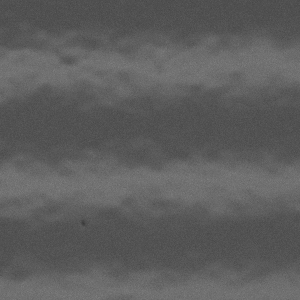 | 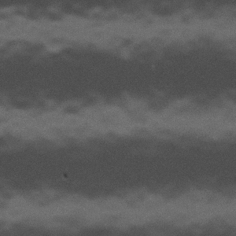 | 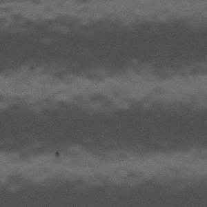 | 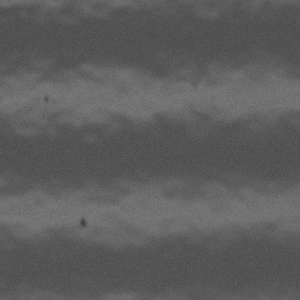 |

### Inclusion（夹杂）

样本 ID：`00_0001_000083_1470_1890_300_300`（[标签](examples/inclusion/label.txt)）

| AP（带标注） | AP | sin0 | sin1 | sin2 | sin3 |
|---|---|---|---|---|---|
| 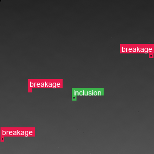 | 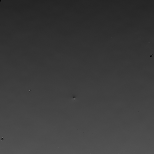 | 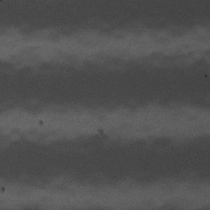 | 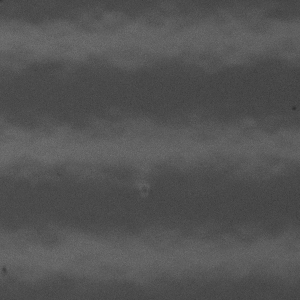 | 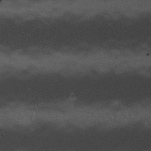 | 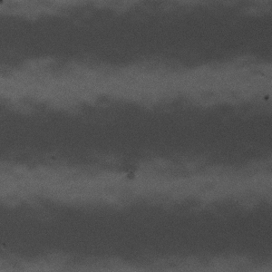 |

### Scratch（划痕）

样本 ID：`00_0015_000547_1470_1680_300_300`（[标签](examples/scratch/label.txt)）

| AP（带标注） | AP | sin0 | sin1 | sin2 | sin3 |
|---|---|---|---|---|---|
| 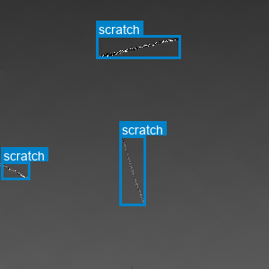 |  | 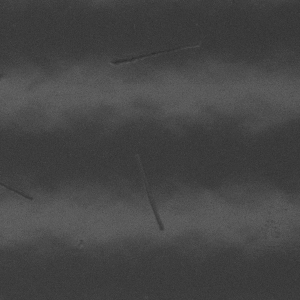 | 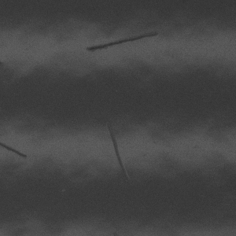 | 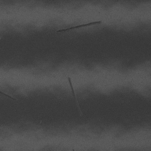 | 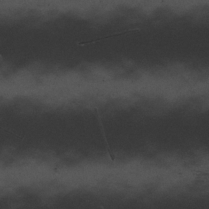 |

### Crater（缩孔）

样本 ID：`00_0005_000291_1260_2132_300_300`（[标签](examples/crater/label.txt)）

| AP（带标注） | AP | sin0 | sin1 | sin2 | sin3 |
|---|---|---|---|---|---|
| 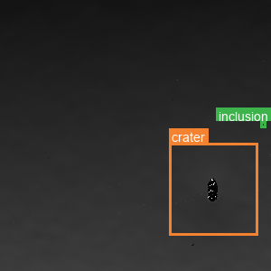 | 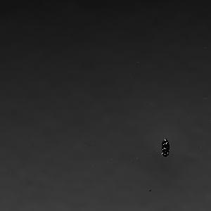 | 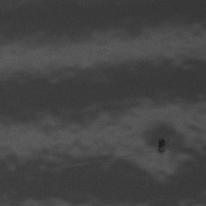 | 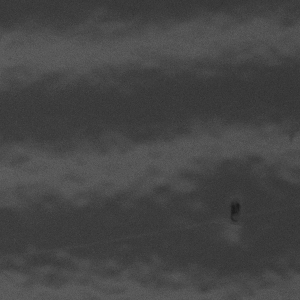 | 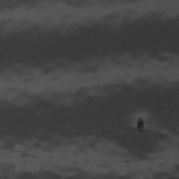 | 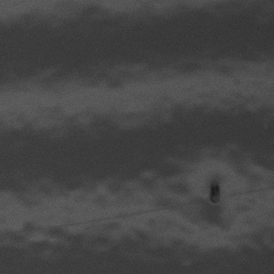 |

### Run（流挂）

样本 ID：`00_0007_000376_1680_0420_300_300`（[标签](examples/run/label.txt)）

| AP（带标注） | AP | sin0 | sin1 | sin2 | sin3 |
|---|---|---|---|---|---|
|  | 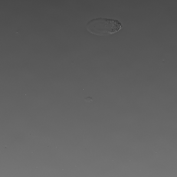 | 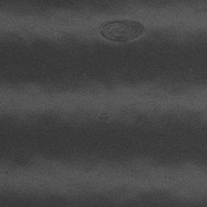 | 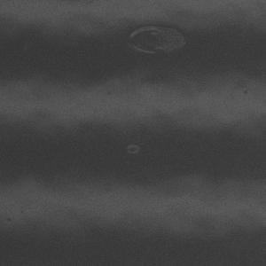 | 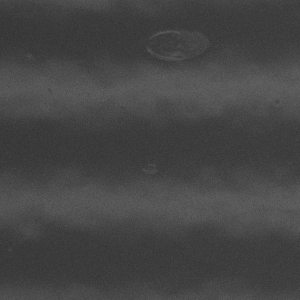 | 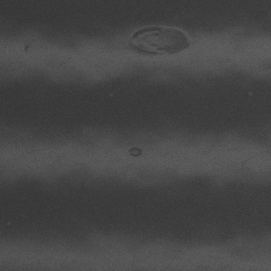 |

### Bulge（凸起）

样本 ID：`00_0023_000819_1470_1260_300_300`（[标签](examples/bulge/label.txt)）

| AP（带标注） | AP | sin0 | sin1 | sin2 | sin3 |
|---|---|---|---|---|---|
| 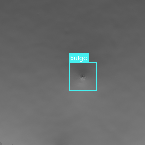 | 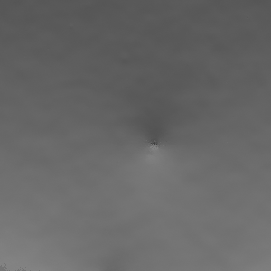 | 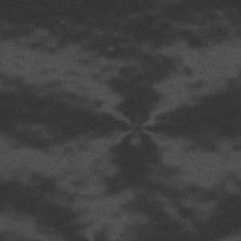 | 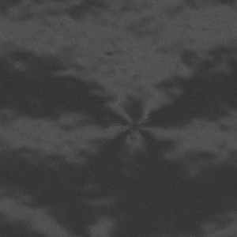 | 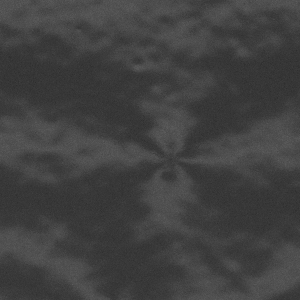 | 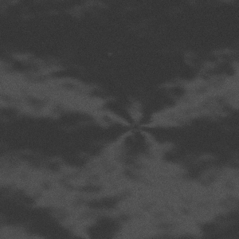 |

### Condensate（凝露）

样本 ID：`00_0022_000779_1050_1890_300_300`（[标签](examples/condensate/label.txt)）

| AP（带标注） | AP | sin0 | sin1 | sin2 | sin3 |
|---|---|---|---|---|---|
| 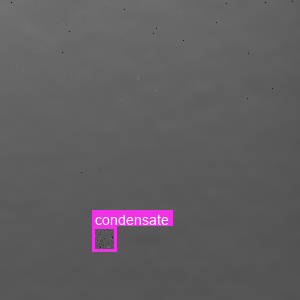 |  |  |  | 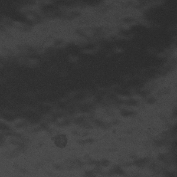 |  |

## 许可证

除非另有说明，本仓库及相关数据集采用 [Creative Commons 署名—非商业性使用 4.0 国际许可协议](https://creativecommons.org/licenses/by-nc/4.0/deed.zh-hans)（CC BY-NC 4.0）。复用必须限于非商业用途，必须提供适当署名，并说明是否对材料进行了修改。详细信息见 [LICENSE](LICENSE)。

## 引用

仓库及相关论文的元数据确定后，将在此处补充引用信息。
